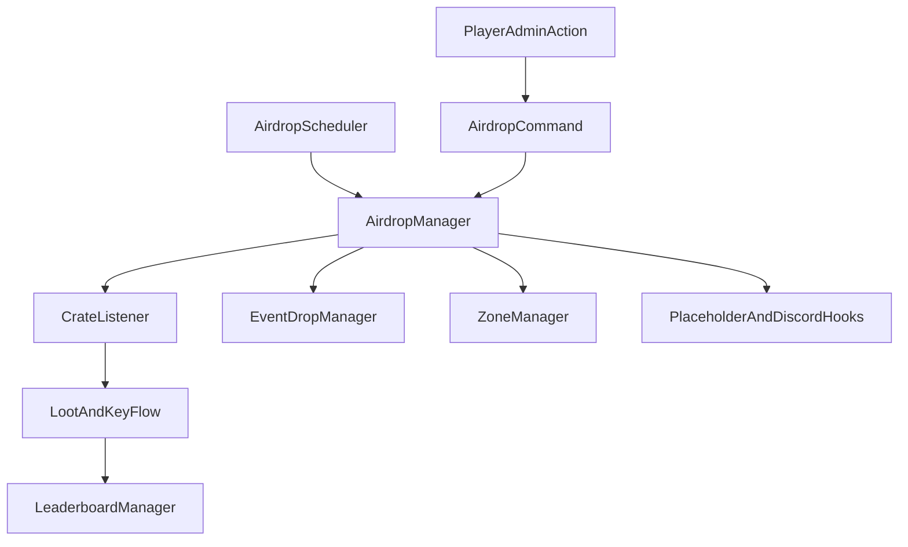

# Architecture Overview

## Runtime Flow

## Component Responsibilities

- `AirdropPlugin` initializes all managers, listeners, commands, and integration hooks.
- `ConfigManager` loads `config.yml`, `events.yml`, and `zones.yml` values consumed at runtime.
- `AirdropScheduler` controls periodic drop timing and schedule windows.
- `AirdropManager` owns active crate state, spawning, despawn, and claim transition logic.
- `CrateListener` handles landing/open interactions and forwards outcome effects.
- `EventDropManager` controls temporary event states (double, eclipse, surge, seasonal).
- `ZoneManager` resolves candidate locations (zone sets and world-border mode).
- `LeaderboardManager` persists and queries opener statistics through SQLite.

## Data And Config Artifacts

- `config.yml`: operational and balancing controls
- `events.yml`: seasonal and event defaults
- `zones.yml`: zone coordinates and weights
- `loot/*.yml`: reward pools by tier/season
- `airdrop_stats.db`: leaderboard storage
- `history.log`: recent drop operation trace

## Startup Sequence

1. Load configs and default resources.
2. Load loot tables and zones.
3. Initialize systems (heatmap, keys, debris, leaderboard, manager stack).
4. Register listeners and command executor/completer.
5. Register PlaceholderAPI hook when available and enabled.
6. Run seasonal checks and start scheduler.
